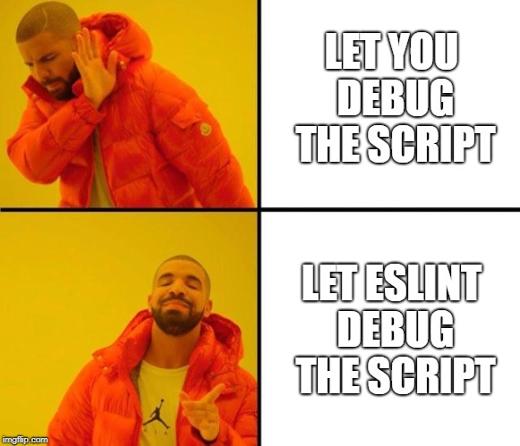

Coding standards are often scolded upon, seeming like nitpicky details that don’t matter much in the function of the program. But, I’m here to tell you that coding standards are the difference between a nice, expensive steak on a clean plate with a little leafy garnish and stuffing that all in a blender and drinking your delectable steak. Pretty picture, isn’t it? That’s exactly what coding style gives us – a prettier picture. These coding standards make my programs more readable to other users and have a uniform format. Overall, coding standards greatly influence the overall taste and quality of “the dish”. 

## Why a Dynamic Duo?

My interest in Javascript sparked when I started using ESLint in IntelliJ. ESLint is used to analyze your code and it flags any violation of coding standards. But that’s not all, it also gives you suggestions on how to fix it! How great is that? It saves me a lot of stress and hair-pulling. 

For example, in Javascript, the constant struggle on whether to use ‘var’, ‘let’, or ‘const’ for variables. It’s not just about aesthetics, it is a cornerstone to writing clear, readable code that is technically sound. ESLint also helps with bug reduction and expedited debugging.

I often hear people say that during an interview, when people are looking at your code, the first thing they notice is your coding style. Is it clean, readable, and clear? Because sometimes it’s not the computer science professionals conducting the interview. Sometimes it’s someone that may know very little about computer science. But if your code looks messy, then they might assume all your work is messy. 

With all the gentle nudges in the right direction, I gradually became more familiar with ESLint and eventually I was making those corrections on my own. 

*Plus, who doesn’t like to see the satisfying little “green checkmark”?*

