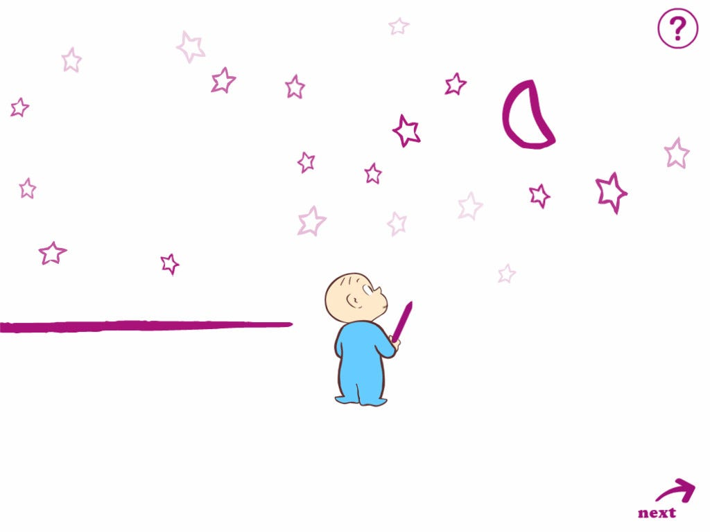

## Coding Canvas
In the vast canvas of software development, design patterns are the artist's palette, offering a spectrum of colors to transform abstract ideas into tangible, structured solutions. Imagine the codebase as a canvas ready to be painted with design patterns as we set out on our creative adventure, each one adding a special touch to the final product.
Fundamentally, design patterns are the strokes that infuse the chaotic world of code with beauty and order. Think of the Factory Method pattern as the paintbrush of the artist, producing items without giving precise class names. This design pattern is used as a flexible brushstroke in my own projects, enabling the construction of many things inside the same framework. The Factory Method design gave me the freedom to instantiate objects with ease, much like an artist moves between brushes with ease.
Consider the Decorator pattern as the intricate detailing in a painting, where additional features embellish a base object dynamically. In a project where user interface elements required dynamic enhancements, the Decorator pattern adorned my code, allowing for the graceful augmentation of functionality.

## Application to the Canvas

In the palette of my code, I've carefully selected and applied design patterns much like an artist chooses colors to create a visually appealing masterpiece. I added dynamic embellishments to UI elements, creating an artistic touch that extended and refined the functionality of buttons and text boxes seamlessly.

One prominent aspect of my design choices revolved around color themes. Recognizing the psychological impact of colors, I carefully selected combinations that were not only visually pleasing but also held significance in user experience. For instance, the incorporation of yellow as a dominant color was deliberate, given its association with hunger. This choice was particularly apt for a website titled "College Cuisine Connect," where the color yellow could evoke a sense of appetite and engagement among users.
Furthermore, I maintained a consistent design pattern throughout the codebase to ensure a cohesive and user-friendly interface. This consistency was evident in the styling of elements such as buttons, text boxes, and user interfaces. By adopting a uniform style for these components, I aimed to create a seamless and intuitive experience for users. The use of consistent design patterns not only contributed to the overall visual harmony of the application but also facilitated ease of navigation and interaction, fostering a more user-centric design.
In summary, my code reflects a thoughtful integration of design patterns, with a particular emphasis on color themes and consistent styling. By prioritizing both aesthetic appeal and user interaction, I aimed to create a visually engaging and user-friendly experience, exemplified by the deliberate choice of colors and the adherence to a unified design pattern throughout the application.
