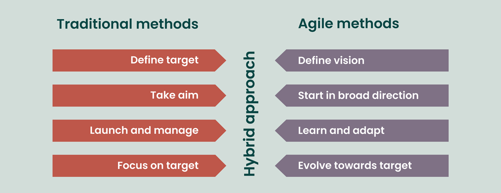

Beyond the mere acquisition of technical skills, my goals were to foster a profound applicational understanding of fundamental software engineering concepts – through Agile project management and design patterns.

### Agile Project Management: Unveiling the Dynamic Dance of Development
Agile Project Management is a methodology that has adaptability and collaboration, extends far beyond the confines of web application development. Agile fundamentally supports iterative development, ongoing feedback loops, and adaptability to project needs that change. Within this paradigm, Issue Driven Project Management stands out as a unique methodology. Agile approaches easily include Issue Driven Project Management, which emphasizes the significance of locating and fixing particular issues at every stage of the development lifecycle.
When imagining how agile project management may be used for purposes other than web applications, picture a manufacturing environment where the concepts of agility are put to use. Similar to a development sprint, a production line can gain from responsive modifications and incremental enhancements based on issues that arise in real time. Issue Driven Project Management's intrinsic flexibility may enable a quick-thinking approach to problem-solving, improving productivity when dealing with unanticipated obstacles. As a result, Agile's dynamic dance is not limited to the digital sphere and may be skillfully performed to plan success in a variety of project environments.
### Design Patterns: The Timeless Blueprints of Software Architecture
Similar to architectural blueprints, design patterns are universal frameworks that help software developers build systems that are adaptable, scalable, and maintainable. Though they are frequently linked to web application architecture, the importance of design patterns extends beyond particular fields and resonates as core ideas throughout the larger field of software engineering.
Through the use of design patterns that extend beyond web apps, software developers may build scalable, reliable structures that can be used to a variety of projects. As a kind of common language, these patterns let engineers communicate with one other regardless of the particular application or technology stack they work with.
### Conclusion
Beyond the tangible skills acquired in web application development, the course has been a gateway to the expansive world of software engineering concepts. The deep dive into Agile Project Management and Design Patterns has not only enriched my technical repertoire but has also broadened my understanding of adaptable methodologies and timeless architectural principles. Armed with these insights, I feel better equipped to navigate the dynamic landscapes of software engineering, whether charting the course for web applications or venturing into uncharted territories where the principles of Agile and design patterns serve as reliable companions. This journey has been more than an academic exploration; it has been a transformative odyssey that empowers me to craft elegant solutions and approach diverse projects with a discerning and strategic mindset.

