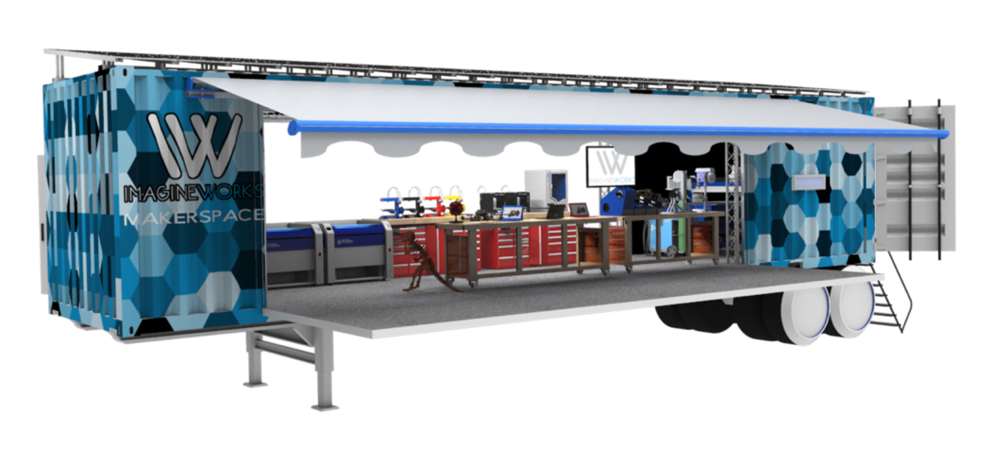

From 2018 - 2022, I was a part of Kalani High School's FIRST (For Inspiration and Recognition of Science and Technology) Robotics team (Team Magma 3008). FIRST gives many opportunities to build ourselves up for challenges we may face in the real world, giving us the tool box for innovation, critical thinking, gracious professionalism, and hopes for the future. 

I am so grateful for the doors and windows that FIRST robotics has opened for me. Robotics has been a challenge for the past years; having to project manage entire robotics competitions, to wrangling a team together to get a robot built, attending various community service and outreach programs. But like everything, I am always up for a challenge! I have really grown as an individual through Team Magma and I feel ready for my future.

<ul>
  <li>In 2020, I was named the captain of my school's robotics team.</li>
  <li>In 2021, I won the World's Dean's List Award.</li>
</ul>

Part of being a part of Robotics was working with the MakeMobile. 

What Are Its Goals?
Team Magma not only specializes in fostering robotics and the magic of science, technology, engineering, art, and mathematics (STEAM) for students, but it also expands over more complex systems and production practices that are the future of engineering, manufacturing and design. The ProtoLab, also known as the MakeMobile, encourages students and team members alike to engage in prototyping technologies and the engineering process. In order to provide a hub for all the advanced technologies utilized by the team, they are housed in a retrofitted shipping container, custom modified with self-reliance and autonomy in mind.

What Does it Contain?
Inside the container of machinery that advances students' understanding of engineering, are many tools that teach skills of the trade. The MakeMobile includes 3D printers, laser cutters, engravers, and even a mini CNC Handibot in its arsenal of machinery to match the creative capacity of its students and the robotics team. The laser cutters are used for producing our teams line of products, and are consequently most often used. However, these machines exercise students’ creativity as the students are free to create their own projects.
A hallmark of its origin and its purpose, this custom fitted shipping container features customized modifications that match the level of craft it holds inside. For sustainability and mobility, the MakeMobile has been outfitted with solar panels and saltwater batteries that generate the electrical output to power the machines it holds. And as such, it can be used off the grid and off campus, able to power the manufacturing machines it houses without external power and zero emissions.

What Role Does It Play?
For now, the MakeMobile resides on campus, established as the main hub of manufacturing that both the robotics team and Kalani engineering students use. It is utilized by the students to prototype, manufacture, and fabricate a variety of parts and products that are used or sold. The MakeMobile also helps the students to further their knowledge and experience of design and manufacture, aiding them in their STEAM focused endeavors. The machines used in the MakeMobile also are the main drive for our manufacturing and production endeavors, and is also where the team sources their line of products. The team has already made an impact in the community by utilizing the manufacturing power they have, and were able to put their engineering skills to use and produce things for others. 
