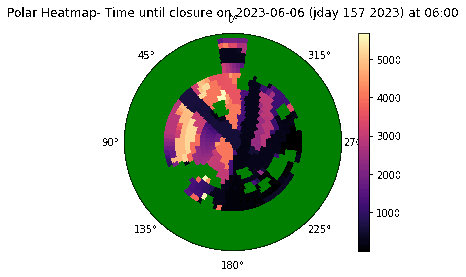
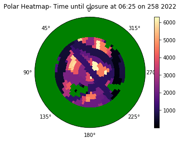

In the summer of 2023, I had the privilege of being chosen to participate in the <a href="https://www.akamaihawaii.org/preparing-for-akamai-internship/" target="_blank">Akamai Workforce Initiative</a>. This remarkable opportunity led me to the picturesque landscapes of the Big Island of Hawaii, where I had the honor of contributing to a significant project. Specifically, I engaged in meaningful work at the 2.2-meter telescope on Maunakea.

This experience provided me with a valuable opportunity to delve deeper into the realm of computer science and its profound implications within the field of astronomy. Furthermore, it allowed me to cultivate and refine my technical skill set, culminating in the organization and execution of a culminating symposium (<a href="https://docs.google.com/presentation/d/1ra2PYJSnuvDenjbpefHL5-Dop-cXw9YU2Lx039eOBu8/edit?usp=sharing" target="_blank" rel="noopener noreferrer">here</a>).</p>

<hr>

Abstract:

<a href="https://www2.ifa.hawaii.edu/Robo-AO/" target="_blank">Robo-AO</a> operational information presents an opportunity to assess the potential negative impacts of the growing population of satellites, especially the new mega-constellations, on laser astronomy and the ability to observe the sky. The Robo-AO systems are autonomous laser adaptive-optics instruments designed for high resolution astronomy with few-meter class telescopes. Robo-AO-2 is currently being commissioned at the University of Hawaii 2.2 meter telescope (UH88) on Maunakea. These systems fire a laser into the sky as a reference to understand how to correct for atmospheric disturbance. Predictive Avoidance Messages (PAMs) from US Space Command provide guidance, in the form of open/closure windows, on when and where it is safe to utilize lasers, i.e. to avoid damaging satellites. However, the plain text format of PAMs is difficult to directly comprehend, as it describes information in both spatial and temporal domains.

We are developing a python program that will leverage historical and newly received PAM files to understand satellite patterns and assist with operational decision-making. This visualization and analysis tool will analyze the percentage each area is open and how long until the next closure. 

<hr>




Here is some example code to illustrate what the information for the PAMs were stored as:

```
class Cell:
    # Function Name: __init__
    # Description: In class Cell: Represents a cell with observation data.
    # Parameters: 
    #      day (str): the day associated with the observation data.
    #      mission_st (datetime): the mission start time. 
    #      mission_end (datetime): the mission end time.
    #      az (tuple): the azimuth range for the observation.
    #      alt (tuple): the altitude range for the observation.
    #      df (DataFrame): the observation data as a panda DataFrame.
    # Returns: None
    def __init__(self, day, mission_st, mission_end, az, alt, df, raw_df):
        self.day = day
        self.missionstart = mission_st
        self.missionstop = mission_end
        self.az = az
        self.alt = alt
        self.df = df
        self.raw_df = raw_df

    # Function Name: observefilter()
    # Description: In class Cell: Filters the observation data based on the 
    #      required total duration of observation. 
    # Parameters: None
    # Returns: filtered_df (DataFrame) : the new filtered dataframe. 
    def observefilter(self, val):
        #print("### OBSERVEFILTER() ###")
        filtered_df = self.df[self.df["Duration (sec)"] >= val]
        if filtered_df.empty:
            #print("No observations with the required total duration found.")
            return filtered_df
        else:
            #print("Observations with the required total duration or more:")
            self.df = filtered_df
            return(self.df)
        
    # Function Name: datetimefilter()
    # Description: In class Cell: Filters the observation data based on the 
    #      specified date and time range. 
    # Parameters: 
    #      start_date (str): the start date and time in the format 
    #          'YYYY-MM-DD HH:MM:SS'.
    #      end_date (str): the end date and time in the format
    #          'YYYY-MM-DD HH:MM:SS'.
    # Returns: filtered_df (DataFrame) : the new filtered dataframe. 
    def datetimefilter(self, start_date=mission_st, end_date=mission_end):
        #global mission_st, mission_end  # Declare df as a global variable
        #df = self.df
        #print("### DATETIMEFILTER() ###")
        #print(start_date)
        #print(end_date)
        # Convert mission start and end dates to strings
        filtered_df = self.df[(self.df["Start Time"] <= end_date) & (self.df["End Time"] >= start_date)]
        if filtered_df.empty:
            #print("No observations within the specified date and time range found.")
            return(filtered_df)
        else:
            #print("Observations within the specified date and time range:")
            self.df = filtered_df
            return(self.df)

    # Function Name: percentage()
    # Description: In class Cell: Calculates the percentage of observaton time based on
    #      the minimum duration and ideal start and end times. 
    # Parameters: None
    # Returns: percent (float): the percentage of observation time. 
    def percentage(self, val):
        #global mission_st, mission_end
        #print("### PERCENTAGE() ###")
        # Call the observefilter() function to return the data with the minimum duration needed to observe
        filtered_df = self.observefilter(val)
        if filtered_df.empty:
                percent = 0.0
                return(percent)
        # Call the datetimefilter() function to return the data with ideal start and end times
        filtered_df = self.datetimefilter(self.missionstart, self.missionstop)
        if filtered_df.empty:
                percent = 0.0
                return(percent)
        mission_dur = (self.missionstop - self.missionstart).total_seconds()
        filtered_dur = filtered_df["Duration (sec)"].sum()
        percent = (filtered_dur / mission_dur) * 100
        return(percent)

    # Function Name: timeUntilClosure()
    # Description: In class Cell: Filters the observation data based on the
    #      specified ideal start and end times. 
    # Parameters: None
    # Returns: filtered_df (DataFrame): Filtred observation data within the 
    #      ideal start and end times.
    def timeUntilClosure(self, given_time):
        #print("### TIMEUNTILCLOSURE() ###")
        #Call the datetimefilter() function to return the data with ideal start and end times
        filtered_df = self.datetimefilter(self.missionstart, self.missionstop)
        
        filtered_df = self.df
        #Find the next closure after the given time
        
        for index, row in filtered_df.iterrows():
            start_time = row["Start Time"]
            end_time = row["End Time"]
            if start_time <= given_time <= end_time:
                difference = end_time - given_time
                #print(difference.total_seconds())
                return difference.total_seconds() #Return the time difference in secs
        return 0 #If no closrue is found after the given time
    
    # Function Name: binaryTimeUntilClosure()
    # Description: In class Cell: Is the cell open during this time? Yes or no
    # Parameters: given_time
    # Returns: difference (in seconds)
    def binaryTimeUntilClosure(self, given_time):
        #print("### BINARYTIMEUNTILCLOSURE() ###")
        filtered_df = self.datetimefilter(self.missionstart, self.missionstop)
        
        filtered_df = self.df
        #Find the next closure after the given time
        
        for index, row in filtered_df.iterrows():
            start_time = row["Start Time"]
            end_time = row["End Time"]
            if start_time <= given_time <= end_time:
                return 1
        return 0 #If no closrue is found after the given time
```
 
Source: <a href="http://localhost:8888/notebooks/akamai/test%20cases/MASTER%207_31_23-Copy1.ipynb#">jupyter notebook.</a>
